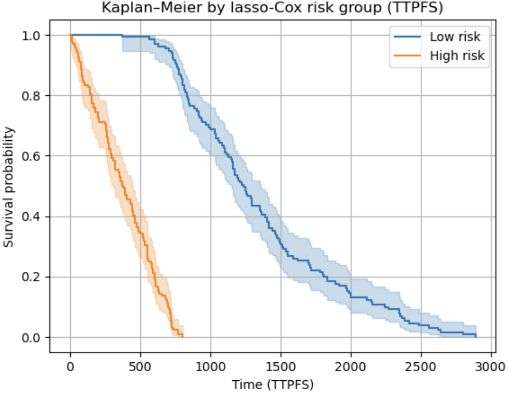

# PROJECT TITLE 
Survival Prediction in Multiple Myeloma Using MAF-Regulated Gene Signatures

## NON-TECHNICAL EXPLANATION OF YOUR PROJECT
Multiple myeloma is a blood cancer where patients relapse at very different times. This project investigates whether a group of genes controlled by the transcription factor MAF can help predict how soon a patient’s cancer will worsen. Using publicly available CoMMpass patient data, which include age, stage of disease and gene expression, we build a machine-learning survival model called a lasso-Cox model. This model selects the most informative MAF-regulated genes and combines them with clinical features to estimate each patient’s risk of early progression. The results show clear separation between high- and low-risk groups and highlight biological pathways linked to poor outcomes.

## DATA
This project uses two datasets:
BETA MAF target genes — identified using ChIP-seq (MAF binding sites) and RNA-seq comparing MAF-depleted versus control conditions. These analyses provide a list of genes whose expression is directly regulated by MAF.
MMRF CoMMpass patient dataset — includes clinical variables (age, sex, ISS stage, LDH, cytogenetic lesions), RNA-seq gene expression, and progression-free survival information (ttpfs, censpfs).
Due to licensing restrictions, raw CoMMpass data are not included in the repository. Only processed tables (survival_gene.tsv and the MAF-target gene list) are provided, with download instructions in the data/README_data.md.
Together, these datasets allow us to test whether MAF-regulated gene expression is associated with time to progression.

## MODEL 
We use a lasso-penalised Cox proportional hazards model. The Cox model predicts a patient’s hazard of earlier progression, while the lasso penalty performs automatic feature selection among many MAF-regulated gene expressions. This is ideal when the number of genes is large relative to the number of patients. The model is implemented using the CoxnetSurvivalAnalysis function from scikit-survival, wrapped in a preprocessing pipeline that standardises all predictors.
The model outputs a continuous risk score, which is then used to define high-risk and low-risk groups visualised by Kaplan–Meier curves.

## HYPERPARAMETER OPTIMSATION
The lasso-Cox model has one main hyperparameter:
λ (alpha) — controls the strength of the lasso penalty.
We tune λ using 5-fold cross-validation within a GridSearchCV pipeline. The grid spans a sequence of alphas from 10⁻³ to 10¹.
For each alpha, cross-validation evaluates model fit via a monotonic score (negative MAE of partial likelihood). The best alpha is selected automatically. The final model corresponds to the optimal balance between over-fitting and under-fitting. 

## RESULTS
The model selects a small set of MAF-regulated genes and clinical variables with non-zero coefficients. These features significantly stratify patients into high-risk and low-risk groups based on the predicted risk of progression. The Kaplan–Meier curves show a strong separation between these groups, indicating that the selected gene signature is highly predictive of time to progression. The concordance index (C-index) suggests strong predictive ability on the available dataset, though external validation is needed to confirm generalisability.

 images of plots using the code below:

## (OPTIONAL: CONTACT DETAILS)
Qizhen Jia
qj22@ic.ac.uk

